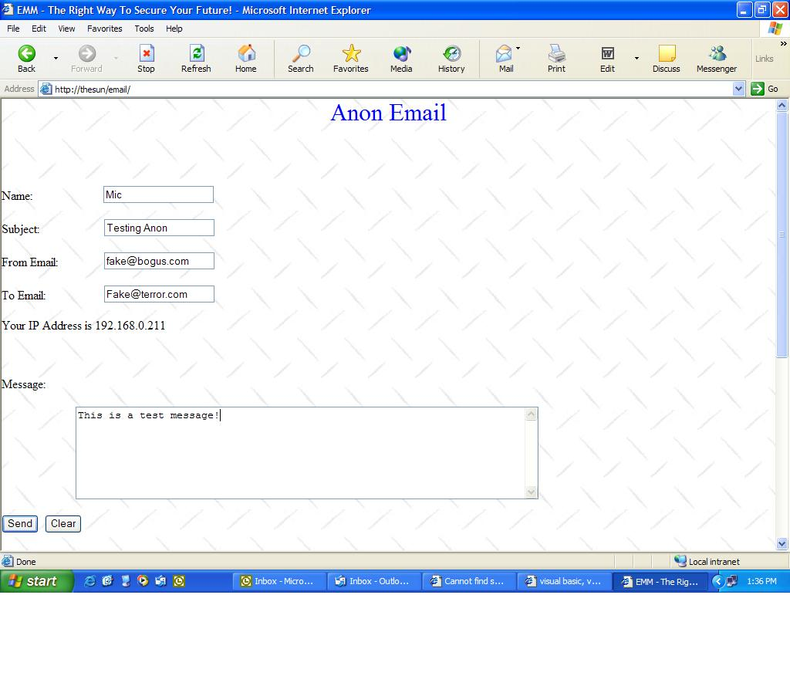



## Anonymous Email Msg \[ASP Code\]

### Description

Send email messages anonymously across the internet or intranet. Great for making a paging service. Can also be altered to get feedback from your own web site. Just set the To Address up as a static address. Set it up on a Personal Web Server or a Remote Host. If you chain your local server through many proxies, you could essentially have true anonymitity. This code is not intended for illegal use. Please be responsible in downloading this code. Could potentially be dangerous in the wrong hands.

I now have a Server setup for you to see how this works live. The only difference is that it tracks your IP, Email Address you sent to, and the message you sent. The email that is sent to the person has YOUR IP address in Bold for them to see. This is just a precaution so that you DO NOT Abuse it. If you want to see the live server and recieve a temporary USERID and PASSWORD, send me an email to mheath30@hotmail.com. Subject="REQUEST USERNAME, PASSWORD, AND SERVER ADDRESS FOR ANON EMAIL". In the body leave your name and address.(For security precautions only.) You must use a real email account! No hotmails, yahoos, email.com, or anything like that. I'm sorry that the prerequisits are high, but I have to ensure you won't ABUSE the server. If you feel like sending more email, send me a second one Subject="Send EMM Info".

Thank you, Enjoy the code!
 
### More Info
 
Message, Subject, From Address, To Address

SMTP Services must be running on the host machine. Host machine must also be capable of running Active Server Pages.

             |
---                |---
**Submitted On**   |2002-10-14 11:38:42
**By**             |[Michael Heath](https://github.com/Planet-Source-Code/PSCIndex/blob/master/ByAuthor/michael-heath.md)
**Level**          |Beginner
**User Rating**    |4.0 (16 globes from 4 users)
**Compatibility**  |VB Script, ASP \(Active Server Pages\) 
**Category**       |[Internet/ HTML](https://github.com/Planet-Source-Code/PSCIndex/blob/master/ByCategory/internet-html__1-34.md)
**World**          |[Visual Basic](https://github.com/Planet-Source-Code/PSCIndex/blob/master/ByWorld/visual-basic.md)
**Archive File**   |[Anonymous\_14604410142002\.zip](https://github.com/Planet-Source-Code/michael-heath-anonymous-email-msg-asp-code__1-5285/archive/master.zip)

